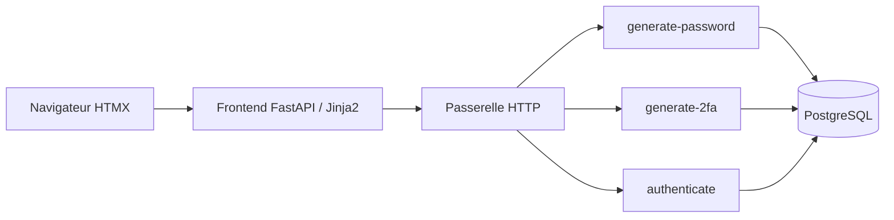

# Architecture

COFRAP est un prototype d’authentification avec mot de passe généré et second
facteur TOTP (code fourni par une application d’authentification).

## Composants



La passerelle est OpenFaaS sur k3s, ou Nginx en développement Docker local.
Le frontend appelle les fonctions par HTTP : il n’accède pas à la base et n’a pas
besoin de la clé de chiffrement. Les fonctions produisent aussi les QR codes.

| Emplacement | Rôle |
| --- | --- |
| `src/cofrap/frontend/` | Pages HTML, API JSON et client HTTP des fonctions |
| `functions/generate-password/` | Inscription, remise unique et renouvellement du mot de passe |
| `functions/generate-2fa/` | Configuration TOTP et activation du compte |
| `functions/authenticate/` | Connexion, session et déconnexion |
| `src/cofrap/domain/` | Modèle utilisateur, expiration et erreurs métier |
| `src/cofrap/application/` | Interfaces, résultats et gestion des jetons |
| `src/cofrap/infrastructure/` | PostgreSQL, chiffrement, TOTP et QR codes |
| `src/cofrap/contracts.py` | Validation des entrées HTTP |
| `src/cofrap/function_runtime.py` | Démarrage des fonctions et connexions à la base |

Chaque fonction a un `handler.py` pour HTTP et un `service.py` pour les règles
métier. Le package commun `src/cofrap` est installé dans chaque image.
Les migrations Alembic préparent la base avant le démarrage des fonctions.

## Parcours utilisateur

1. **Inscription** : un mot de passe de 24 caractères est généré. Le compte reste inactif.
2. **Remise** : un lien ou un QR permet de révéler le mot de passe une seule fois.
   Le QR contient le lien temporaire, pas le mot de passe.
3. **Activation** : après la remise, l’utilisateur configure son application TOTP
   et confirme un code. Cette confirmation démarre les six mois de validité.
4. **Connexion** : le mot de passe et un nouveau code TOTP ouvrent une session.
5. **Renouvellement** : après six mois calendaires, les anciens facteurs valides
   donnent uniquement un jeton de renouvellement. Celui-ci remplace les deux
   facteurs et impose une nouvelle activation.

Les six mois sont calculés à la même heure UTC, avec ajustement au dernier jour
si nécessaire : une activation le 31 août expire le dernier jour de février.
L’expiration est vérifiée à l’usage ; aucun traitement planifié ne marque les comptes.

| Jeton | Durée |
| --- | --- |
| Activation et remise | 15 minutes à partir de l’inscription ou du renouvellement |
| Renouvellement | 5 minutes |
| Session | 30 minutes au maximum, sans dépasser l’expiration des identifiants |

Une seule session est conservée par compte : une nouvelle connexion remplace la
précédente. Le renouvellement révoque les anciens jetons et la session.

## Stockage et sécurité

Les données métier sont dans la table `users` de PostgreSQL.

| Donnée | Stockage |
| --- | --- |
| Mot de passe | Hachage Argon2id |
| Mot de passe en attente de remise | Chiffrement Fernet, effacé lors de la remise |
| Secret TOTP | Chiffrement Fernet |
| Jetons temporaires et de session | Empreintes SHA-256 |
| Dernier pas TOTP accepté | Entier empêchant la réutilisation d’un code |

Le TOTP utilise 6 chiffres, des pas de 30 secondes et une tolérance d’un pas avant
ou après. Les transactions et le verrouillage des lignes empêchent les doubles
remises et la réutilisation concurrente d’un code TOTP.

La remise est enregistrée avant la réponse HTTP. Si cette réponse est perdue,
le mot de passe ne peut plus être récupéré. Le client ne relance donc pas
automatiquement les appels aux fonctions.

Les formulaires HTML utilisent des cookies `HttpOnly`, `SameSite=Strict` et un
jeton CSRF. Sous HTTPS, `COOKIE_SECURE=true` et `PUBLIC_BASE_URL` doit correspondre
à l’origine publique. Les routes JSON protégées utilisent des jetons Bearer ;
la remise transmet son jeton dans le corps JSON.

Les réponses interdisent le cache. Le jeton du lien de remise se trouve après `#`,
puis est retiré de l’adresse et envoyé par POST après confirmation. Un simple GET
ne consomme pas la remise.

## Maintenance locale

Les jetons expirés sont refusés immédiatement, mais leur suppression physique
nécessite cette commande, avec la base et les secrets configurés dans `.env` :

```sh
.venv/bin/python -m cofrap.infrastructure.maintenance
```

Elle efface les jetons expirés et les mots de passe chiffrés dont la remise a
expiré. Elle conserve les utilisateurs, leurs hachages et leurs secrets TOTP.
Elle n’est pas planifiée automatiquement.

## Vérification et limites

`make check` lance les contrôles de style et les tests unitaires.
`make test-integration` utilise PostgreSQL 17, les migrations réelles et les trois
applications de fonction via un transport HTTP de test. Ces tests couvrent les
règles métier et les réponses HTML, mais pas un navigateur réel ni le cluster k3s.

La récupération de compte, la limitation de débit, les invitations, les sauvegardes
et la rotation des clés ne sont pas implémentées. Un facteur perdu ou une activation
abandonnée nécessite une intervention hors du parcours prévu.

Voir le [développement local](developpement.md) pour Docker et le
[déploiement OpenFaaS](openfaas.md) pour k3s.
