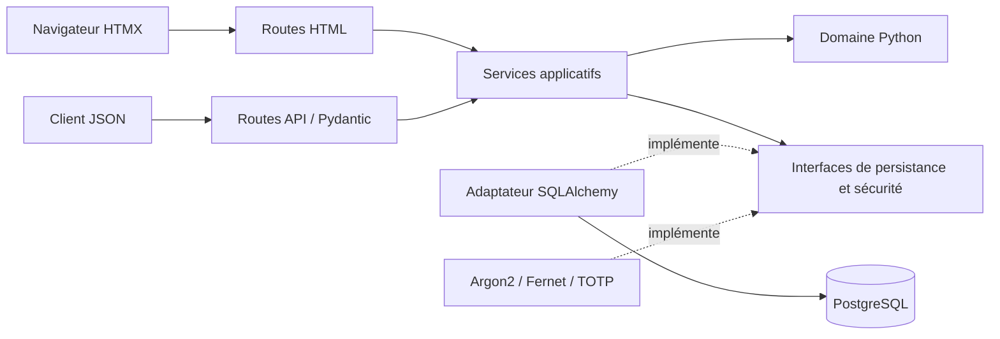
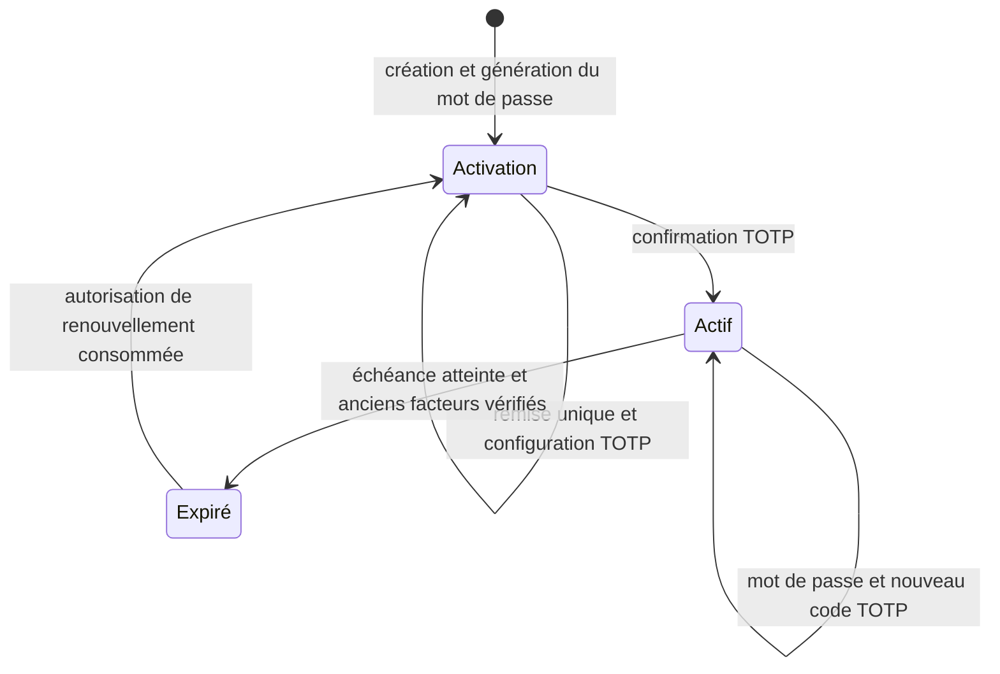

# Architecture et décisions

## Dépendances



`main.py` assemble configuration, pool SQL, adaptateurs, services et routes.
Les paramètres utilisent Pydantic Settings. Les services reçoivent une fabrique
de transactions et une horloge pour tester les échéances sans modifier les routes.

Python répond au contexte COFRAP. FastAPI expose les schémas Pydantic et OpenAPI.
PostgreSQL fournit persistance, contraintes et verrouillage transactionnel. HTMX
permet des formulaires progressifs sans dupliquer les règles métier en JavaScript.

Références : [organisation FastAPI](https://fastapi.tiangolo.com/tutorial/bigger-applications/),
[configuration](https://fastapi.tiangolo.com/advanced/settings/),
[cycle de vie](https://fastapi.tiangolo.com/advanced/events/),
[documentation HTMX](https://htmx.org/docs/).

## États et autorisations



Le compte ne devient actif qu’après preuve de possession du TOTP. `generated_at`
est fixé à cette activation, quand le couple devient utilisable. Les 15 minutes
d’activation ne font pas partie de la période d’utilisation.

La limite correspond à **six mois calendaires**, à la même heure UTC. Le 31 août
expire le dernier jour de février. L’égalité avec l’échéance signifie déjà expiré.

Les anciens facteurs sont vérifiés avant d’annoncer l’expiration et de donner
l’autorisation de renouvellement. Cela empêche un reset par quelqu’un connaissant
seulement le login. `expired` est alors persisté, sans créer de session normale.

Le renouvellement révoque les autorisations / sessions, remplace le mot de passe
et efface l’ancien TOTP. Le compte reste inutilisable jusqu’à la confirmation du
nouveau TOTP. Une transaction empêche l’observation d’un état partiellement écrit.

## Stockage sensible

Une table `users`, avec des colonnes supplémentaires pour les capacités temporaires.
Le modèle SQL n’est jamais utilisé directement comme réponse HTTP.

| Donnée | Stockage | Raison |
| --- | --- | --- |
| Mot de passe | Hachage Argon2id salé | Vérification sans restitution |
| Mot de passe avant remise | Chiffrement authentifié Fernet | Restitution unique, puis effacement |
| Secret TOTP | Chiffrement authentifié Fernet | Déchiffrement nécessaire à la vérification |
| Jetons temporaires / session | SHA-256 | Jetons aléatoires de 256 bits |
| Dernier pas TOTP accepté | Entier | Rejet du même code et des pas antérieurs |

Les quatre catégories de caractères sont choisies avec `secrets`, complétées
jusqu’à 24 caractères puis mélangées cryptographiquement. TOTP utilise 6 chiffres,
SHA-1, des pas de 30 secondes et une tolérance de ±1 pas. Un pas déjà accepté ne
peut pas être réutilisé, même dans une requête concurrente.

La remise verrouille la ligne, vérifie son échéance, déchiffre, efface le chiffré
et le jeton, puis commit avant de répondre. Une requête simultanée échoue. Si la
réponse réseau est perdue après commit, le mot de passe n’est pas récupérable :
c’est le compromis explicite d’une remise à usage unique.

La clé Fernet et les credentials DB sont lus depuis `.env` en développement ou
les variables d’environnement. Ils ne sont ni dans Git ni dans les templates.
Les paramètres SQL ne sont pas journalisés.

## Frontend et HTTP

- Cookies `HttpOnly`, `SameSite=Strict`, et `Secure` avec `COOKIE_SECURE=true` sous HTTPS.
- Les écritures HTML exigent un jeton CSRF HTMX correspondant au cookie.
  L’origine est contrôlée si fournie : `PUBLIC_BASE_URL` doit correspondre au navigateur.
- Les routes JSON utilisent exclusivement les jetons Bearer, sans authentification
  implicite par cookie de session.
- Réponses `no-store`, `no-referrer`, interdiction d’encadrement et CSP avec
  scripts/styles locaux. Swagger / ReDoc conservent leurs ressources externes.
- Pas de cache d’historique HTMX, pas de scripts reçus dans les fragments,
  pas de secrets dans `localStorage` ni `sessionStorage`.
- Le jeton QR est dans le fragment de l’URL, effacé de l’adresse puis envoyé par
  POST explicite. Les logs d’accès ne l’enregistrent pas. Un GET ne consomme rien.
- Alternatives textuelles sélectionnables aux QR, champs étiquetés, erreurs
  annoncées et navigation clavier prévue.

## Maintenance locale

Les capacités expirées sont refusées même avant nettoyage. Pour supprimer leurs
empreintes et effacer les mots de passe encore en attente de remise :

```sh
.venv/bin/python -m cofrap.infrastructure.maintenance
```

Cette commande ne supprime aucun utilisateur, hachage de mot de passe ni TOTP actif.
La planifier côté exploitation si une purge périodique est souhaitée ; elle n’est
pas lancée automatiquement dans le PoC.

## Validation et limites

Les tests utilisent PostgreSQL 17 isolé, les vraies migrations et les mêmes
adaptateurs que le développement. Les tests concurrents ne reposent pas sur SQLite.

Les tests HTML vérifient réponses et cookies côté serveur. Le rendu visuel et les
interactions JavaScript n’ont pas été vérifiés dans le navigateur intégré : aucun
navigateur n’était disponible dans la session d’implémentation.

La récupération de compte, la limitation de débit et les invitations ne sont pas
implémentées. La maîtrise des abus reste prévue pour l’autre équipe. Ce service
n’est pas encore déployé sur OpenFaaS ; les cas d’usage peuvent être réutilisés
par de futurs adaptateurs serverless sans recopier les règles métier.
