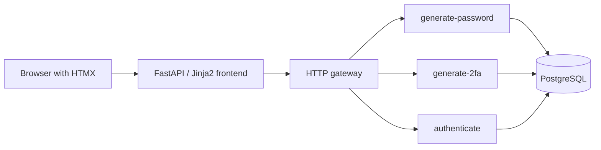
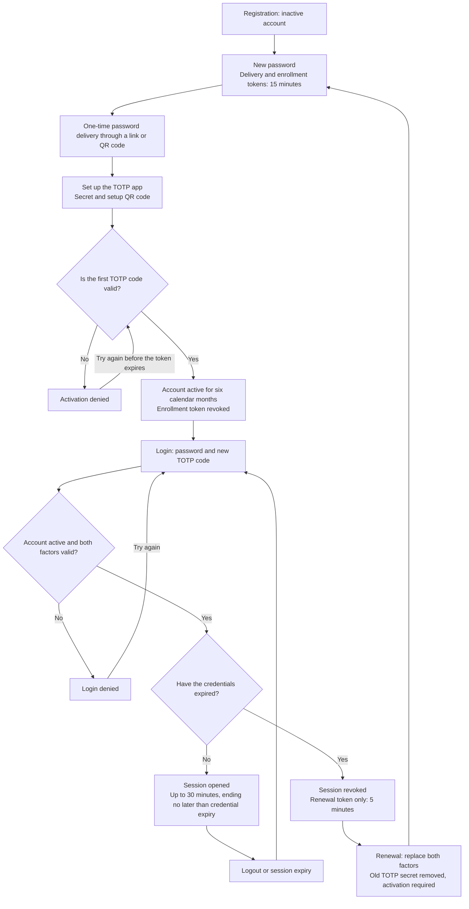

# Architecture

COFRAP is an authentication prototype with a generated password and a TOTP second
factor (a code from an authenticator app).

## Components



The gateway is OpenFaaS on k3s, or Nginx for local Docker development.
The frontend calls the functions over HTTP. It does not access the database and
does not need the encryption key. The functions also create the QR codes.

| Location | Purpose |
| --- | --- |
| `src/cofrap/frontend/` | HTML pages, JSON API, and HTTP client for the functions |
| `functions/generate-password/` | Registration, one-time password delivery, and renewal |
| `functions/generate-2fa/` | TOTP setup and account activation |
| `functions/authenticate/` | Login, session, and logout |
| `src/cofrap/domain/` | User model, expiry rules, and business rule errors |
| `src/cofrap/application/` | Interfaces, results, and token management |
| `src/cofrap/infrastructure/` | PostgreSQL, encryption, TOTP, and QR codes |
| `src/cofrap/contracts.py` | HTTP input validation |
| `src/cofrap/function_runtime.py` | Function startup and database connections |

Each function has a `handler.py` for HTTP and a `service.py` for business rules.
The shared `src/cofrap` package is installed in each image.
Alembic migrations prepare the database before the functions start.

## User flow

1. **Registration**: the system generates a 24-character password. The account stays inactive.
2. **Delivery**: a link or QR code reveals the password once.
   The QR code contains the temporary link, not the password.
3. **Activation**: after delivery, the user sets up their TOTP app and confirms a
   code. This starts the six-month validity period.
4. **Login**: the password and a new TOTP code open a session.
5. **Renewal**: after six calendar months, the old valid factors only give access
   to a renewal token. This token replaces both factors and requires a new activation.

The six months end at the same UTC time. If needed, the date moves to the last day
of the month: activation on August 31 expires on the last day of February.
Expiry is checked when the account is used. No scheduled task marks accounts as expired.

| Token | Lifetime |
| --- | --- |
| Enrollment and delivery | 15 minutes from registration or renewal |
| Renewal | 5 minutes |
| Session | Up to 30 minutes, ending no later than credential expiry |

Each account has only one session. A new login replaces the previous session.
Renewal revokes the old tokens and session.

### TOTP authentication lifecycle



Delivery, activation, and renewal require a valid token. An invalid or expired
token stops the flow. If the renewal token expires, the user can get another one
by logging in again with the old valid factors and a new TOTP code.
An abandoned or expired activation needs help outside the supported flow.

Each code accepted during confirmation or login records its TOTP time step.
Codes from that step or an earlier step are then rejected. This also applies to
the first login after activation. The six-month expiry is checked when credentials
are used. It does not start renewal automatically.

## Storage and security

Business data is stored in PostgreSQL's `users` table.

| Data | Storage |
| --- | --- |
| Password | Argon2id hash |
| Password waiting for delivery | Fernet encryption, deleted on delivery |
| TOTP secret | Fernet encryption |
| Temporary and session tokens | SHA-256 hashes |
| Last accepted TOTP step | Integer that prevents code reuse |

TOTP uses 6 digits and 30-second steps. It accepts a window of one step before or
after the current step. Transactions and row locks prevent duplicate deliveries
and concurrent reuse of a TOTP code.

Delivery is recorded before the HTTP response is sent. If that response is lost,
the password cannot be retrieved again. The client therefore does not retry
function calls automatically.

HTML forms use `HttpOnly`, `SameSite=Strict` cookies and a CSRF token.
With HTTPS, set `COOKIE_SECURE=true` and make `PUBLIC_BASE_URL` match the public
origin. Protected JSON routes use Bearer tokens. Password delivery sends its
token in the JSON body.

Responses disable caching. The delivery link puts the token after `#`. The page
then removes it from the address and sends it by POST after confirmation.
A simple GET does not use up the delivery token.

## Local maintenance

Expired tokens are rejected immediately. To remove their stored values, run this
command with the database and secrets configured in `.env`:

```sh
.venv/bin/python -m cofrap.infrastructure.maintenance
```

It removes expired tokens and encrypted passwords whose delivery period has
ended. It keeps users, password hashes, and TOTP secrets.
It does not run on a schedule automatically.

## Checks and limits

`make check` runs style checks and unit tests.
`make test-integration` uses PostgreSQL 17, real migrations, and the three function
apps through a test HTTP transport. These tests cover business rules and HTML
responses. They do not use a real browser or the k3s cluster.

Account recovery, rate limiting, invitations, backups, and key rotation are not
implemented. A lost factor or abandoned activation needs help outside the supported flow.

See [local development](development.md) for Docker and
[OpenFaaS deployment](openfaas.md) for k3s.
