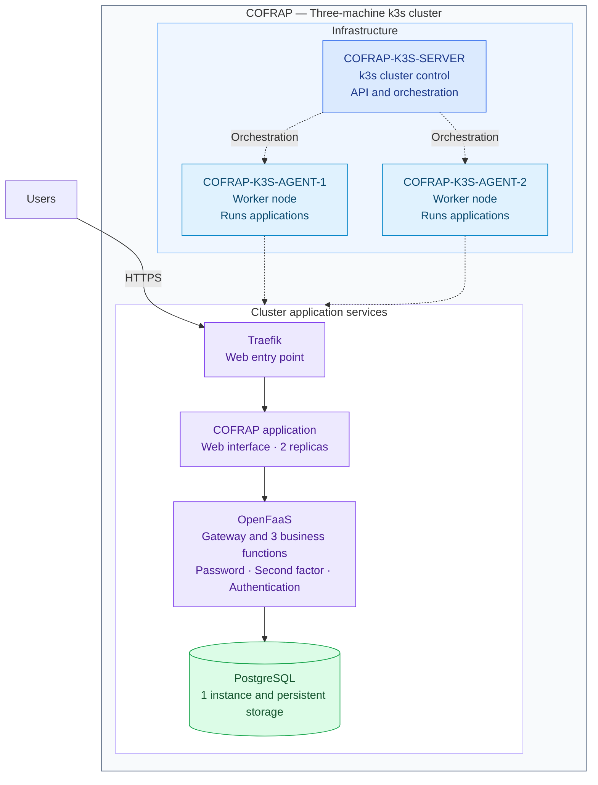

# COFRAP k3s cluster architecture

Solid lines show the request flow. Dotted lines show orchestration and where
applications run.

This view uses the three supplied machine names. Services are shown at cluster
level. The repository manifests do not require them to run on specific nodes,
and their actual placement has not been checked on the cluster. The k3s server
can also run pods, depending on its configuration.

The frontend has two replicas and prefers to spread them across nodes.
PostgreSQL has one instance. The default storage is `local-path`, tied to one node.

Sources: [frontend](../../../deploy/frontend.yaml),
[PostgreSQL](../../../deploy/postgres.yaml),
[OpenFaaS functions](../../../stack.yml),
[Traefik](../../../deploy/frontend-ingress.yaml).
