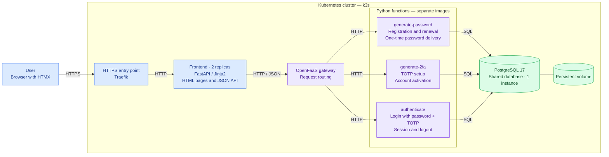

# COFRAP system architecture

## References

- [Frontend HTTP client](../../../src/cofrap/frontend/openfaas_client.py)
- [OpenFaaS function definitions](../../../stack.yml)
- [Traefik entry point](../../../deploy/frontend-ingress.yaml)
- [Frontend deployment](../../../deploy/frontend.yaml)
- [PostgreSQL deployment](../../../deploy/postgres.yaml)
- [Detailed architecture](../architecture.md)
