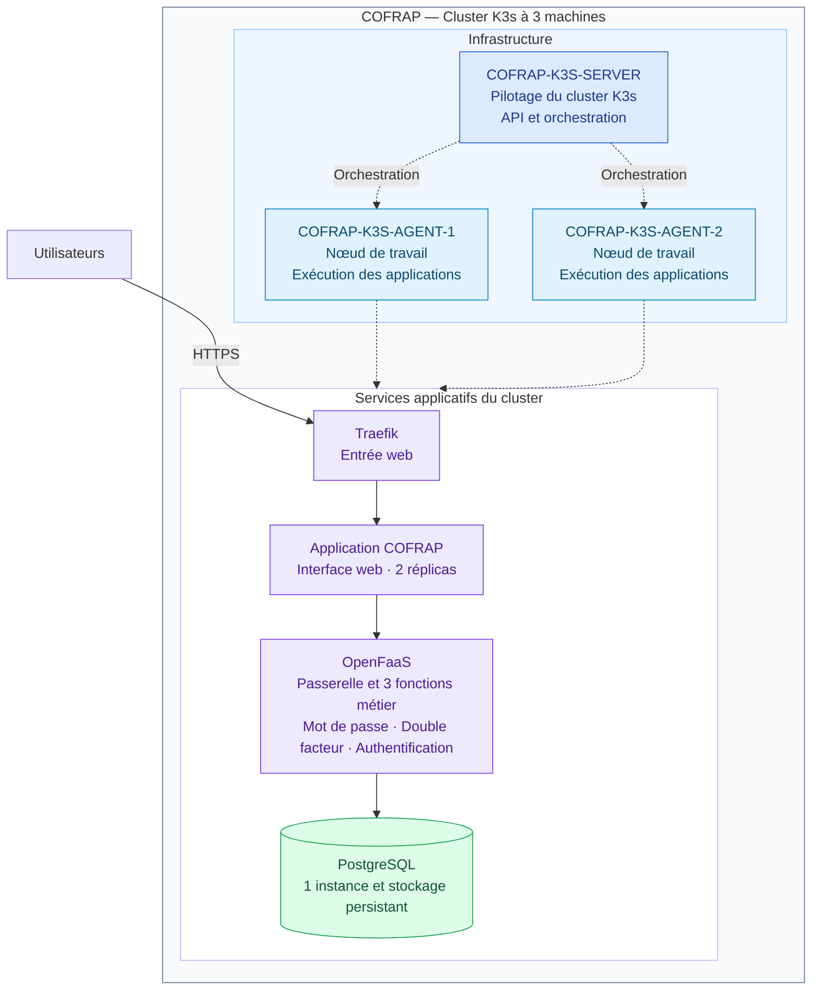

# Architecture globale du cluster COFRAP K3s

Les traits pleins représentent le parcours des requêtes. Les pointillés représentent l’orchestration et l’hébergement des applications.

Cette vue utilise les trois noms de machines fournis. Les services sont représentés à l’échelle du cluster : leur placement exact sur les nœuds n’est pas imposé par les manifestes du dépôt et n’a pas été vérifié sur le cluster. Le serveur K3s peut également exécuter des pods selon sa configuration.

Le frontend possède deux réplicas avec une préférence de répartition entre les nœuds. PostgreSQL possède une seule instance ; le stockage configuré par défaut est `local-path`, lié à un nœud.

Sources : [frontend](../../deploy/frontend.yaml), [PostgreSQL](../../deploy/postgres.yaml), [fonctions OpenFaaS](../../stack.yml), [Traefik](../../deploy/frontend-ingress.yaml).
