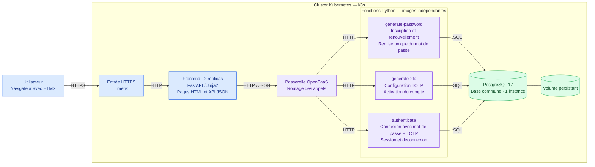

# Architecture globale de COFRAP

## Références

- [Client HTTP du frontend](../../src/cofrap/frontend/openfaas_client.py)
- [Déclaration des fonctions OpenFaaS](../../stack.yml)
- [Entrée Traefik](../../deploy/frontend-ingress.yaml)
- [Déploiement du frontend](../../deploy/frontend.yaml)
- [Déploiement PostgreSQL](../../deploy/postgres.yaml)
- [Architecture détaillée](../architecture.md)

